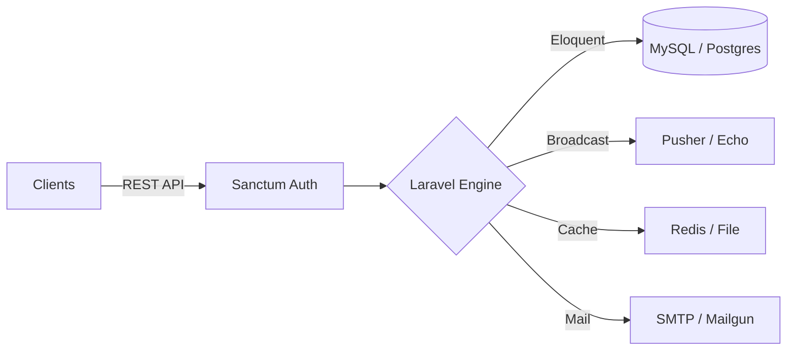

#  Nexus Core | Multi-Vendor API Engine

  

---

## 🛠️ Tech Stack & Infrastructure

  
  
  
  
  

---

## 🚀 Performance Engineering
This core engine is built for extreme efficiency and real-time reliability.

### ⚡ Aggressive Caching Strategy
Using **Laravel Cache-Aside**, we minimize database hits for frequently accessed data:
- **Global Settings**: Cached for 1 hour, auto-invalidated on update.
- **Sales Intelligence**: High-intensity analytics cached for 5 minutes.
- **Notification Counts**: Real-time unread counts cached for 60 seconds per user.

### 📊 SQL Intelligence
We moved heavy computations from PHP memory to the **SQL Database Layer**:
- **Aggregated Queries**: Using `DB::raw` for instant SUM/COUNT/GROUP BY across multi-vendor data.
- **Optimized Indexing**: Custom indexing on `created_at` and `site_id` ensures range queries execute in milliseconds.

---

## 🏗️ System Architecture

---

## 🔐 Advanced Security
- **Multi-Store Sanctum**: Secure token-based authentication with store-specific scopes.
- **Request Lifecycle**: Strict validation layers and CORS protection.
- **Data Integrity**: Foreign key constraints with cascading deletes across vendor scopes.

## 📡 Integrated With
- 🖥️ **[Nexus Admin Dashboard](https://github.com/salahuddingfx/Multi-Vendor-Admin)**
- 🛍️ **[Acharu Boutique](https://github.com/salahuddingfx/Acharu)**
- 🐟 **[TajaShutki Store](https://github.com/salahuddingfx/TajaShutki)**

---

  
  

